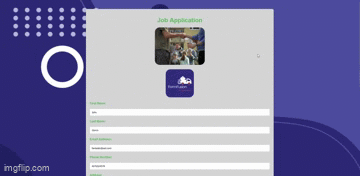

# FormFusion
**IMPORTANT: app will take 50 seconds to load (it is hosted for free) Submit and delete route disabled because I don't want to moderate**

FormFusion makes managing job applications super simple. It helps you collect, view, and organize all your submissions in one place. With just a few clicks, 
you can export everything to a neat Excel file and even delete entries as needed. It’s a smooth, no-fuss way to keep your hiring process on track, all in one easy-to-use platform.

**Link to project:** https://job-application-3lj4.onrender.com/

**Link to admin page:** https://job-application-3lj4.onrender.com/admin

    

## How It's Made: 

**Tech used:** HTML, CSS, JavaScript, Express, Node, MongoDB, Render
A simple static form HTML greets users, the magic does not happen until they click submit. Once a form is filled and submitted, users are given indication the form was submitted successfully, this form is then sent into a mongo db.
I first had to format the date correctly because by default, the dates aren't organized the way I like, m/d/y, then I take all the data from the form and use the gift function from mongo 'insertOne'. I did a great job organizing the form for not using 
a schema. For example, I made the work experience and reference options an array and each submission an object, so if I wanted to add functionality to add another work experience or job reference, it would be simple to just repeat another 
object with the same key value pairs. The party continues over into the admin page. Here you can see an organized view of all the responses currently stored in the database, these are all loaded into an ejs template, so there can be as many 
of few submissions as desired and they don't all have to be hard coded. The admin page also has some other cool features, for example, you can delete submissions from the database with the 
delete button. You can also download the current version of all the data as an excel sheet that will already have the data organized in the excel file. I even made sure to leave a space between submissions for readability.

## Optimizations
This is still a work in progress! I will be adding some styling to the pages. I also want to add a new page to render upon successful form submission so there is something exciting aside from the basic '/submitted successfully' that appears now.
I also want to add a login page to the admin page so that not just anyone with access to the link, can access the page and download the excel file. I could also use mongoose and have each form be a schema. I also could expand my files for organization
*hint hint* MVC *hint hint*.

## Lessons Learned

I learned how to look for Static Outbound IP Addresses and make sure they are whitelisted in my mongo db so that my hosted apps can access the database, I also added environmental variables from my env into my render project to ensure functionality.
I got great practice working on the backend and establishing routes for everything, daily gratitude for express post.
